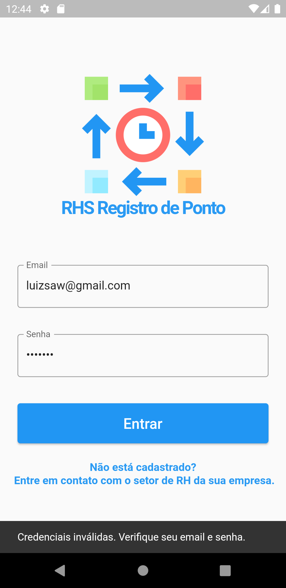
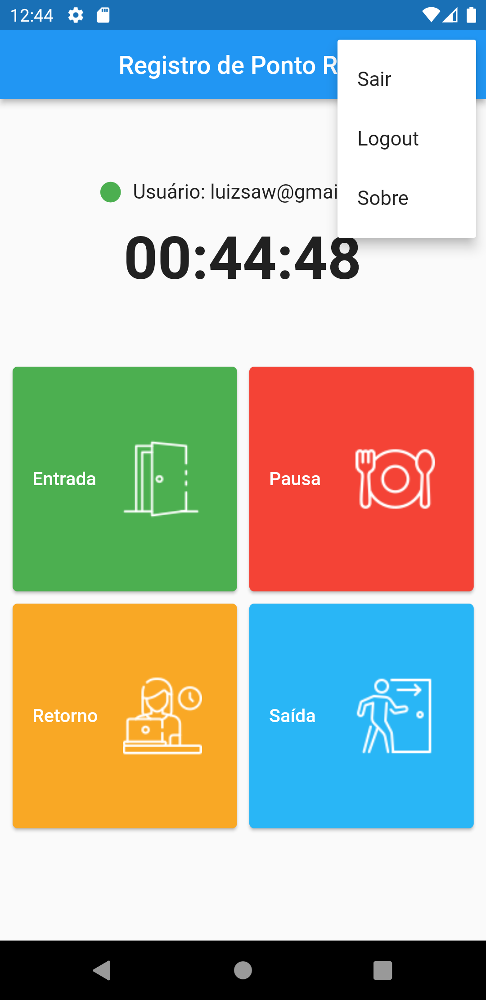

# 📲 Registro de Ponto - App Mobile

Bem-vindo ao Registro de Ponto, um aplicativo mobile desenvolvido em Flutter que permite que funcionários registrem facilmente suas entradas, saídas e intervalos diretamente de seus dispositivos Android.

<p align="center">
  
</p>

---

## 🚀 Funcionalidades

- ✅ Registro de ponto com apenas um toque
- 🕒 Marcação de entrada, saída, pausa para almoço e retorno
- 🔐 Autenticação segura com Firebase
- 🎯 Interface intuitiva e responsiva
  
---

## 🖼️ Capturas de Tela

<p align="center">
  
  
</p>

---

## 🛠️ Tecnologias Utilizadas

| Camada        | Tecnologias               |
|---------------|---------------------------|
| App Mobile    | Flutter, Dart             |
| Backend/Auth  | Firebase Authentication   |
| Build Tools   | Gradle, Android SDK       |

---

## 📁 Estrutura de Pastas

```
lib/
├── firebase_options.dart         # Configurações do Firebase
├── folha_de_ponto.dart           # Página principal do app
├── main.dart                     # Ponto de entrada da aplicação
├── pages/                        # Páginas principais do app
│   ├── login_page.dart
│   ├── home_page.dart
│   └── banco_bados.dart
├── services/                     # Serviços de autenticação
│   └── auth_service.dart
├── widgets/                      # Componentes reutilizáveis
    ├── auth_check.dart
    ├── relogio.dart
    └── usuario_logado.dart

```
---

## 🤝 Contribuições

Contribuições são sempre bem-vindas!  
Sinta-se à vontade para abrir uma *issue*, *forkar* o repositório e enviar um *pull request*.

